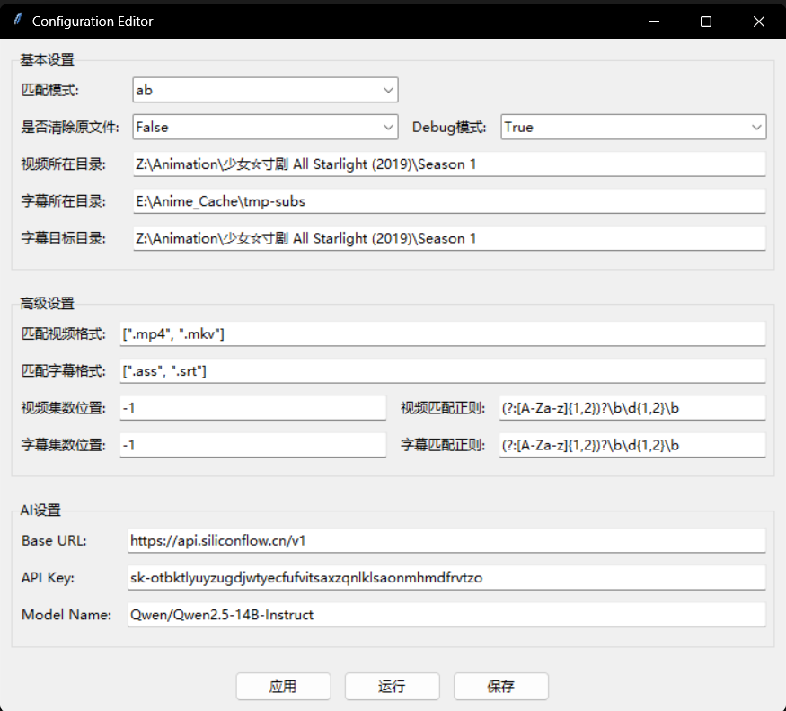

# Anime Subtitle Renamer
<p align="center">
    
</p>

该项目的功能是根据给定视频文件匹配本地字幕并重命名字幕文件。有一个勉强能用的GUI界面。

## 初衷
在使用TinyMediaManager刮削并重命名动画文件之后，视频文件和下载的字幕文件将无法匹配；人工重命名大量文件过于麻烦，所以搭建了一个自动化流程来处理这件事。
本项目的默认集数匹配规则（ab）来源于[AutoBangumi](https://github.com/EstrellaXD/Auto_Bangumi)，因此可能不适用于非动画文件、非动画字幕组的重命名工作。

## Anime Subtitle Renamer功能简介

- 根据给定文件夹地址中视频名自动匹配对应字幕文件并进行重命名，输出至指定文件夹
- 支持修改自定义字幕语言后缀
- 支持自定义匹配的视频、字幕格式
- 支持三种视频-字幕匹配方法
- 可自动清除视频文件夹中的旧字幕文件

## 视频和字幕文件目录说明
Anime Subtitle Renamer可以读取的视频所在目录需满足以下要求：
- 视频文件保存在同一目录下
- 视频所在目录没有其他视频文件干扰
- 视频所在目录的子文件夹中允许存在其他视频文件
- 视频文件有集数标识，如`孤独摇滚！ - S01E01 - 孤独的转机.mkv`或`[DMG&VCB-Studio] BOCCHI THE ROCK! [06][Ma10p_1080p][x265_flac].mkv`
- 示例视频所在目录结构如下：
```
    video_dir
    ├── A S01E01.mp4
    ├── A S01E02.mp4
    ├── A S01E03.mp4
    ├── A S01E04.mp4
    ├── other_none_video_files.ext
    └── other_folder
        ├── other_video1.mp4
        ├── other_video2.mp4
        ├── other_video3.mp4
        └── other_video4.mp4
```

Anime Subtitle Renamer对字幕文件的读取会遍历路径内所有字幕文件，可以读取的字幕所在目录需满足以下要求：
- 字幕所在目录和子文件夹中均不允许存在其他字幕文件
- 字幕文件有集数标识，如`孤独摇滚！ - S01E01 - 孤独的转机.ass`或`[DMG&VCB-Studio] BOCCHI THE ROCK! [06][Ma10p_1080p][x265_flac].srt`
- 示例字幕所在目录结构如下：
```
    sub_src_dir
    │   ├── tc
    │   │   ├── A[01].tc.ass
    │   │   ├── A[02].tc.ass
    │   │   ├── A[03].tc.ass
    │   │   └── A[04].tc.ass
    │   └── sc
    │       ├── A[01].sc.ass
    │       ├── A[02].sc.ass
    │       ├── A[03].sc.ass
    │       └── A[04].sc.ass
```

若将字幕目标目录设置与视频文件所在目录一致，则输出示例应为：
```
    video_dir(sub_src_dir)
    ├── A S01E01.mp4
    ├── A S01E02.mp4
    ├── A S01E03.mp4
    ├── A S01E04.mp4
    ├── A S01E01.custom_language_ext1.ass
    ├── A S01E02.custom_language_ext1.ass
    ├── A S01E03.custom_language_ext1.ass
    ├── A S01E04.custom_language_ext1.ass
    ├── A S01E01.custom_language_ext2.ass
    ├── A S01E02.custom_language_ext2.ass
    ├── A S01E03.custom_language_ext2.ass
    ├── A S01E04.custom_language_ext2.ass
    ├── other_none_video_files.ext
    └── other_folder
        ├── other_video1.mp4
        ├── other_video2.mp4
        ├── other_video3.mp4
        └── other_video4.mp4
```

## 配置说明
### 基本配置
- 是否清除原文件（clear_files）：如果是True，则在生成新字幕文件前删除字幕目标目录下所有字幕文件
- Debug模式（debug_mode）：如果是True，则不会生成新字幕文件，而是弹窗显示当前配置下字幕文件重命名的预计结果
- 视频所在目录（video_dir)
- 字幕所在目录（sub_src_dir)
- 字幕目标目录（sub_tar_dir）：设置与视频所在目录，则实现Jellyfin（或其他播放器）对外部字幕文件的自动读取


