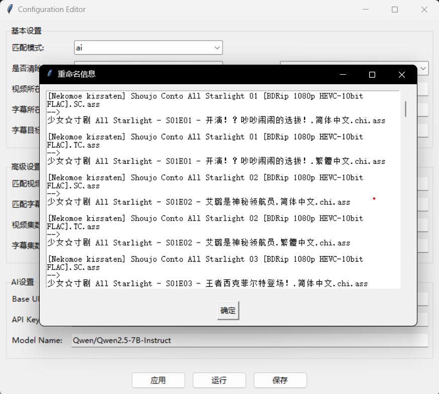

# Anime Subtitle Renamer

<p align="center">
    
</p>

该项目的功能是根据给定视频文件匹配本地字幕并重命名字幕文件。有一个勉强能用的GUI界面。

## 初衷

在使用TinyMediaManager刮削并重命名动画文件之后，视频文件和下载的字幕文件将无法匹配；人工重命名大量文件过于麻烦，所以搭建了一个自动化流程来处理这件事。
本项目的默认集数匹配规则（ab）来源于[AutoBangumi](https://github.com/EstrellaXD/Auto_Bangumi)，因此可能不适用于非动画文件、非动画字幕组的重命名工作。

## Anime Subtitle Renamer功能简介

- 根据给定文件夹地址中视频名自动匹配对应字幕文件并进行重命名，输出至指定文件夹
- 支持修改自定义字幕语言后缀
- 支持自定义匹配的视频、字幕格式
- 支持三种视频-字幕匹配方法
- 可自动清除视频文件夹中的旧字幕文件

## 视频和字幕文件目录说明

Anime Subtitle Renamer可以读取的视频所在目录需满足以下要求：

- 视频文件保存在同一目录下
- 视频所在目录没有其他视频文件干扰
- 视频所在目录的子文件夹中允许存在其他视频文件
- 视频文件有集数标识，如`孤独摇滚！ - S01E01 - 孤独的转机.mkv`或`[DMG&VCB-Studio] BOCCHI THE ROCK! [06][Ma10p_1080p][x265_flac].mkv`
- 不支持合集，如`A E01-04.mp4`
- 示例视频所在目录结构如下：

```
    video_dir
    ├── A S01E01.mp4
    ├── A S01E02.mp4
    ├── A S01E03.mp4
    ├── A S01E04.mp4
    ├── other_none_video_files.ext
    └── other_folder
        ├── other_video1.mp4
        ├── other_video2.mp4
        ├── other_video3.mp4
        └── other_video4.mp4
```

Anime Subtitle Renamer对字幕文件的读取会遍历路径内所有字幕文件，可以读取的字幕所在目录需满足以下要求：

- 字幕所在目录和子文件夹中均不允许存在其他字幕文件
- 字幕文件有集数标识，如`孤独摇滚！ - S01E01 - 孤独的转机.ass`或`[DMG&VCB-Studio] BOCCHI THE ROCK! [06][Ma10p_1080p][x265_flac].srt`
- 示例字幕所在目录结构如下：

```
    sub_src_dir
    │   ├── tc
    │   │   ├── A[01].tc.ass
    │   │   ├── A[02].tc.ass
    │   │   ├── A[03].tc.ass
    │   │   └── A[04].tc.ass
    │   └── sc
    │       ├── A[01].sc.ass
    │       ├── A[02].sc.ass
    │       ├── A[03].sc.ass
    │       └── A[04].sc.ass
```

若将字幕目标目录设置与视频文件所在目录一致，则输出示例应为：

```
    video_dir(sub_src_dir)
    ├── A S01E01.mp4
    ├── A S01E02.mp4
    ├── A S01E03.mp4
    ├── A S01E04.mp4
    ├── A S01E01.custom_language_ext1.ass
    ├── A S01E02.custom_language_ext1.ass
    ├── A S01E03.custom_language_ext1.ass
    ├── A S01E04.custom_language_ext1.ass
    ├── A S01E01.custom_language_ext2.ass
    ├── A S01E02.custom_language_ext2.ass
    ├── A S01E03.custom_language_ext2.ass
    ├── A S01E04.custom_language_ext2.ass
    ├── other_none_video_files.ext
    └── other_folder
        ├── other_video1.mp4
        ├── other_video2.mp4
        ├── other_video3.mp4
        └── other_video4.mp4
```

## 使用流程

1. 调整视频所在目录、字幕所在目录文件结构，见[视频和字幕文件目录说明](#视频和字幕文件目录说明)
2. 按照实际情况修改基本配置中的视频所在目录、字幕所在目录、字幕目标目录（视频所在目录和相同则可以实现播放器中字幕自动识别）
3. 设置是否清除原文件为False、Debug模式为True，运行程序，弹出窗口预览当前配置下字幕文件重命名的预计结果

<p align="center">
    
</p>

4. 确认重命名无误，设置是否清除原文件为True、Debug模式为False，运行程序，完成重命名字幕文件的生成

## 配置说明

### 基本配置

- 是否清除原文件（clear_files）：如果是True，则在生成新字幕文件前删除字幕目标目录下所有字幕文件
- Debug模式（debug_mode）：如果是True，则不会生成新字幕文件，而是弹窗显示当前配置下字幕文件重命名的预计结果
- 视频所在目录（video_dir）
- 字幕所在目录（sub_src_dir）
- 字幕目标目录（sub_tar_dir）：设置为与视频所在目录相同，则实现Jellyfin（或其他播放器）对外部字幕文件的自动读取

### 高级配置（若无匹配失败情况不建议修改）

- 匹配视频格式（video_ext）：python列表格式，默认为`['mp4', 'mkv']`，确定哪些后缀的文件将被视为视频
- 匹配字幕格式（subtitle_ext）：python列表格式，默认为`['ass', 'srt']`，确定哪些后缀的文件将被视为字幕
- 匹配模式（match_method）：可选ab、raw<del>、 ai（开发中，暂时不要选择）</del>
- 匹配位置（match_pos）：仅在`raw`模式下有效，输入应为大于等于-1的整数，用于确定匹配字幕文件集数在文件名中对应的位置（可能存在匹配出多个数字的情况），默认为-1，即匹配出的最后一个数字，0表示匹配出的第一个数字，1表示匹配出的第二个数字，以此类推，一般选择0或-1即可
- 匹配正则表达式（pattern）：仅在`raw`模式下有效，输入应为字符串形式正则表达式，用于匹配字幕文件名中的集数信息，默认为`(?:[A-Za-z]{1,2})?\b\d{1,2}\b`

### 隐藏配置

- language_ext：原字幕语言后缀与自定义字幕语言后缀映射，json格式，用于生成新字幕语言名，如`tc`和`sc`将被转换为`繁體中文.chi`和`简体中文.chi`，默认为：

```
{
    "chs": "简体中文.chi",
    "cht": "繁體中文.chi",
    "dm-chs": "简体中文.chi",
    "dm-cht": "繁體中文.chi",
    "tc": "繁體中文.chi",
    "sc": "简体中文.chi",
    "jptc": "繁日字幕.chi",
    "jpsc": "简日字幕.chi"
}
```

## 匹配模式介绍

### ab模式

- 默认和推荐的匹配模式
- 使用[AutoBangumi](https://github.com/EstrellaXD/Auto_Bangumi)中[raw_parser.py](https://github.com/EstrellaXD/Auto_Bangumi/blob/main/backend/src/module/parser/analyser/raw_parser.py)的正则表达式匹配视频和字幕文件中的集数信息

### raw模式（个人调试用）

- 仅支持TinyMediaManager中默认重命名规则（`${showTitle} - S${seasonNr2}E${episodeNr2} - ${title}`）命名的视频集数识别
- 使用自定义的正则表达式匹配字幕文件中的集数信息
- 需配合匹配位置（match_pos）、匹配正则表达式（pattern）两参数使用
- 一般工作流程为：使用pattern提取字幕文件中候选的数字信息，再使用match_pos选择的正确的集数信息

### <del>ai模式</del>

- 开发中，请勿选用
